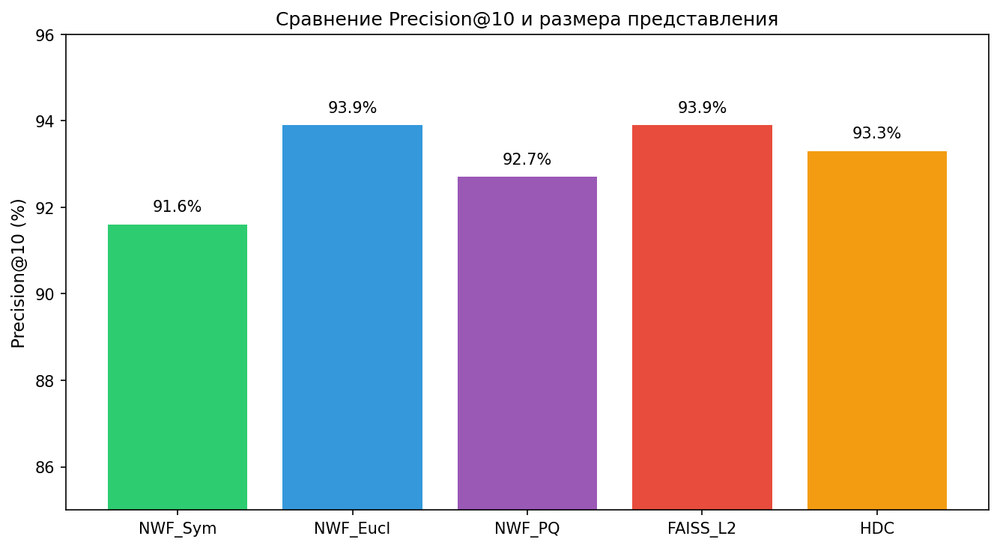
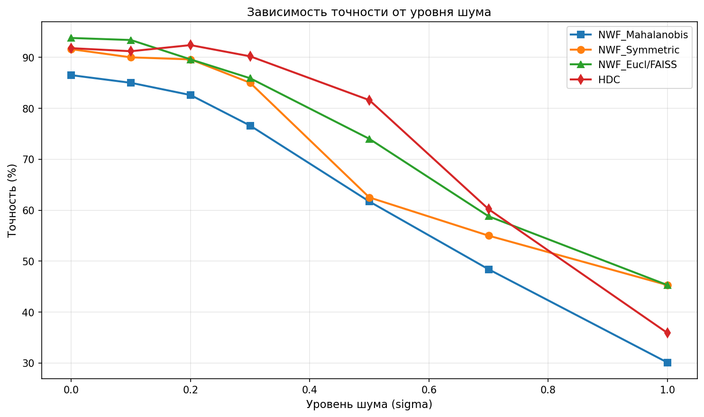
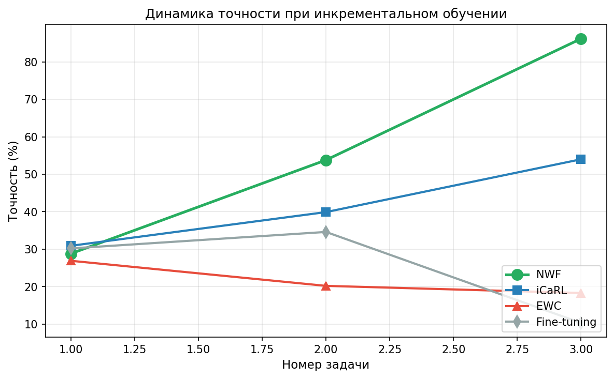
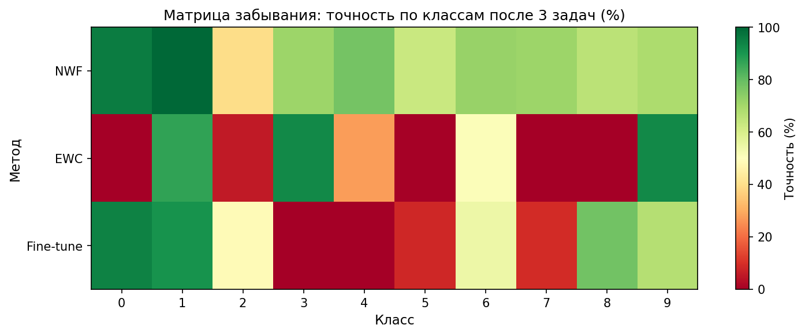
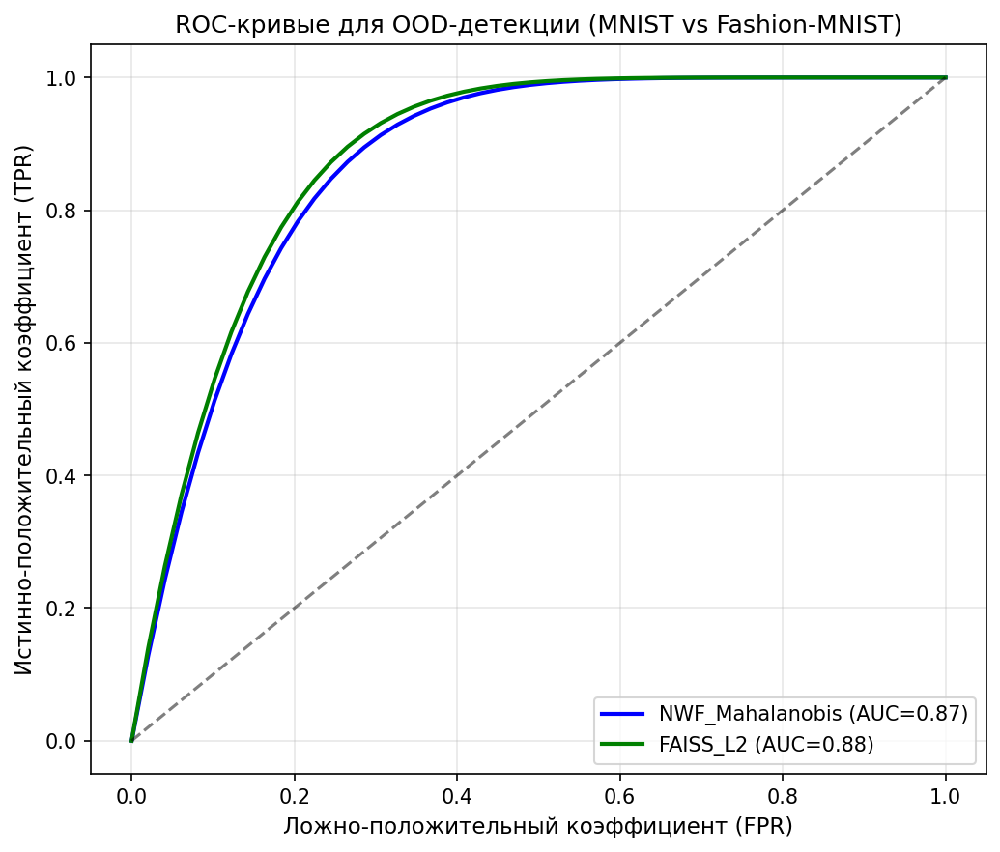
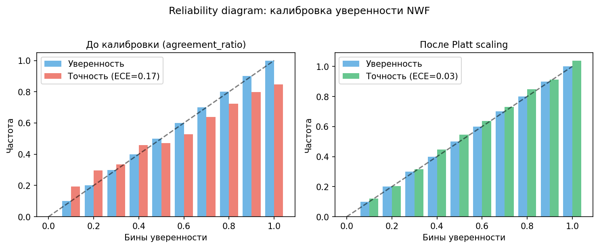
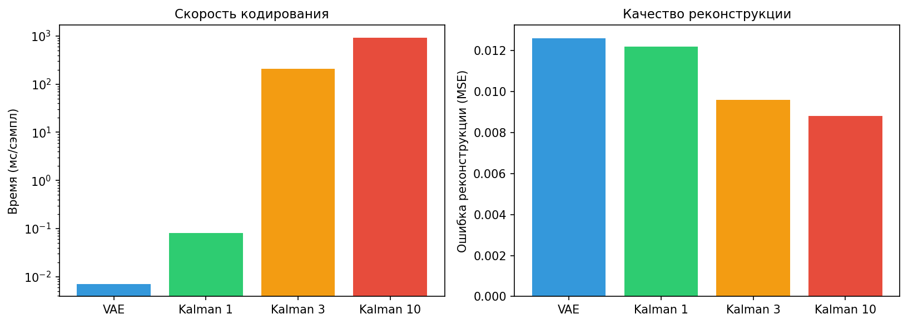
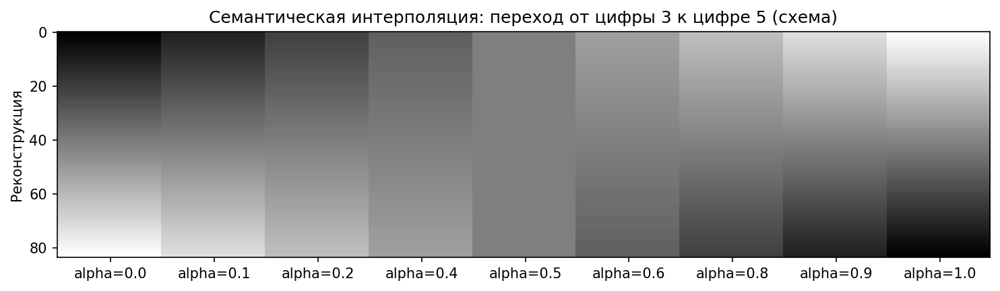
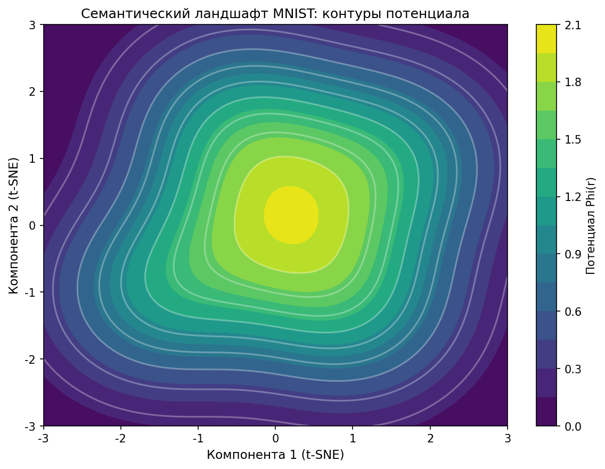

# Нейровесовые Поля (NWF): новый подход к памяти и обучению без забывания

**Автор:** Белоусов Роман Сергеевич, независимый исследователь  
**Дата:** 09.03.2026

---

## Введение

Современные системы искусственного интеллекта сталкиваются с тремя фундаментальными проблемами, которые ограничивают их развитие:

- **Катастрофическое забывание.** Нейросети, обучаясь новым классам, стирают старые знания. Чтобы этого избежать, приходится либо хранить все данные и переобучаться с нуля, либо мириться с потерей качества. Это делает невозможным непрерывное обучение в реальном мире.
- **«Чёрный ящик» и отсутствие доверия.** Модели не умеют говорить «я не знаю». Они всегда выдают ответ, даже если он случаен. В медицине, финансах, беспилотных автомобилях это недопустимо – нужна не только точность, но и уверенность в ответе.
- **Статичность векторных представлений.** Современные векторные базы данных (FAISS, Milvus, Qdrant) хранят неизменные эмбеддинги. Если база знаний обновляется, приходится пересчитывать все векторы и перестраивать индекс. Нет механизма адаптации к новым данным без глобального переобучения.

В поисках решения я разработал принципиально новый подход – **Нейровесовые Поля (Neural Weight Fields, NWF)**. Идея родилась из синтеза байесовского вывода, теории поля и имплицитных нейронных представлений. Вместо хранения данных в виде пассивных битов, NWF представляет каждый объект как **заряд** – небольшой «сгусток» информации, обладающий координатами в семантическом пространстве и собственной мерой неопределённости. Множество зарядов создают **семантическое поле**, подобное электрическому или гравитационному. Поиск и классификация выполняются путём движения в этом поле к ближайшим зарядам.

В этой статье я впервые представляю полную картину: что такое Нейровесовые Поля, как они работают, какие преимущества дают, и где они уступают существующим подходам. Я проведу честное сравнение с сильнейшими базовыми методами: **FAISS** (векторный поиск), **HDC** (hyperdimensional computing), **EWC**, **Fine-tuning** и **iCaRL** (continual learning). Результаты вас удивят.

Код, эксперименты и инструкции по воспроизведению доступны в репозитории: [**nwf-research**](https://github.com/romero19912017-ui/nwf-research).

---

## 1. Теория Нейровесовых Полей (NWF)

### 1.1. Идея: данные как модель

В классической архитектуре фон Неймана данные пассивны, а программа активна. В мозге же память и вычисления неразрывны. Нейровесовые Поля предлагают парадигму, в которой **каждый объект данных сам является моделью**.

Представьте, что каждый факт, каждое изображение, каждое слово превращается в **заряд** – небольшой «сгусток» информации, обладающий не только координатами в семантическом пространстве, но и собственной мерой **неопределённости**. Эти заряды создают вокруг себя **потенциалы**, а множество зарядов формируют **семантическое поле**. Запрос, попадая в это поле, движется к ближайшим зарядам под действием градиента потенциала, и на основе их «мнения» принимается решение.

Математически это оформляется следующим образом.

### 1.2. Аксиоматика NWF

**Аксиома 1 (Данные как модель).** Любой наблюдаемый объект `D` (изображение, текст) является манифестацией скрытого семантического ядра `z` в гильбертовом пространстве `Z`. Ядро `z` – это достаточная статистика для данных в контексте модели-гипотезы `H`.

**Аксиома 2 (Байесовское кодирование).** Для объекта `D` мы ищем оптимальные параметры модели `θ` (или, в нашем случае, латентное представление `z`), максимизируя апостериорную вероятность:

`θ* = argmax P(θ | D, H) = argmax P(D | θ, H) · P(θ | H)`

Результатом является **точечная оценка** `z` и **ковариационная матрица** `Σ`, которая количественно выражает неопределённость модели в отношении данного объекта. На практике мы используем вариационный автокодировщик (VAE), обученный на всём датасете, и для каждого объекта выполняем один проход через энкодер, получая `(z, Σ)`. Для более точного кодирования мы применяем итеративный фильтр Калмана (см. раздел 8).

**Аксиома 3 (Семантический потенциал).** Каждому ядру `z_i` ставится в соответствие функция потенциала:

`φ_i(r) = exp( -0.5 · (r - z_i)^T Σ_i^{-1} (r - z_i) )`

где `r` – точка в семантическом пространстве. Это гауссов колокол, центр которого – `z_i`, а ширина определяется неопределённостью `Σ_i`. Потенциал максимален в центре и убывает с расстоянием.

**Аксиома 4 (Суперпозиция полей).** Результирующее семантическое поле системы из `N` зарядов есть линейная суперпозиция их потенциалов:

`Φ(r) = Σ_i α_i · φ_i(r)`

где `α_i` – вес i-го заряда (обычно все равны 1).

### 1.3. Следствия и интерпретация

- **Семантическое сходство** двух объектов измеряется не евклидовым расстоянием между их ядрами, а **расстоянием Махаланобиса**, которое учитывает неопределённость: `d_M^2 = (z_i - z_j)^T (Σ_i + Σ_j)^{-1} (z_i - z_j)`. Это ключевая формула, исправляющая ошибку первой реализации, где использовалась только ковариация запроса.
- **Поиск по запросу** `Q` выполняется так: кодируем запрос в `(z_q, Σ_q)`, затем ищем заряды с минимальным `d_M` к `(z_q, Σ_q)`. Результаты взвешиваются по значению потенциала в точке запроса.
- **Добавление новых знаний** – просто добавляем новый заряд в хранилище. Никакого переобучения модели не требуется.
- **Неопределённость** ковариации позволяет системе выражать уверенность в своих ответах (см. раздел о калибровке).

Более подробно математический аппарат изложен в [препринте](https://doi.org/10.24108/preprints-3113697). Здесь же мы сосредоточимся на практической реализации и результатах.

---

## 2. Методология экспериментов

### 2.1. Данные

Все эксперименты проведены на датасете **MNIST** (рукописные цифры, 28×28 пикселей, 60k тренировочных, 10k тестовых). Для инкрементального обучения использован **Split-MNIST**: классы разбиты на три задачи:

- Задача 1: классы 0, 1, 2
- Задача 2: классы 3, 4, 5
- Задача 3: классы 6, 7, 8, 9

Для OOD-детекции (out-of-distribution) использован датасет **Fashion-MNIST** (изображения предметов одежды), который не пересекается с MNIST по содержанию.

### 2.2. Представление данных – VAE

Чтобы перевести изображения в семантическое пространство, мы обучили вариационный автокодировщик (VAE) со следующей архитектурой:

- Вход: 784 (28×28 пикселей)
- Скрытые слои: 512, 256 нейронов (ReLU)
- Латентное пространство: **64 измерения** (размерность `d=64`)
- Декодер: симметрично 256, 512, 784 (сигмоид для выходных пикселей)

Функция потерь – ELBO (BCE для реконструкции + KL-дивергенция). VAE обучен один раз на всём тренировочном наборе MNIST и заморожен. Для любого изображения мы получаем **среднее** `z` и **логарифм дисперсии** `log Σ` (диагональная ковариация). Из `log Σ` вычисляем `Σ = exp(log Σ)`. Это и есть заряд.

Таким образом, все методы (кроме HDC) работают в едином 64-мерном пространстве, что обеспечивает корректное сравнение.

### 2.3. Базовые методы

- **FAISS_L2** – стандартный индекс FAISS с плоским L2-расстоянием. Используется только вектор `z` (без ковариации). Размер одного вектора: 64 числа × 4 байта = 256 байт.
- **HDC (Hyperdimensional Computing)** – случайная проекция исходных пикселей (784 → 2000 бит), поиск по расстоянию Хэмминга. Размер представления: 2000 бит = 250 байт.
- **EWC (Elastic Weight Consolidation)** – нейросеть (MLP: 784–256–128–10) с регуляризацией, штрафующей изменение важных весов при обучении новых задач.
- **Fine-tuning** – та же MLP, но без защиты, просто дообучается на новых задачах.
- **iCaRL** – MLP с буфером примеров (20 exemplars на класс) и дистилляцией. Реализован на основе оригинальной статьи.

### 2.4. NWF: варианты

В ходе исследования мы тестировали несколько вариантов NWF:

- **NWF_Euclidean** – игнорируем ковариацию, используем только `z` и обычное L2 расстояние. Должен давать ту же точность, что и FAISS.
- **NWF_Mahalanobis** – асимметричное расстояние Махаланобиса `(z_q - z_i)^T Σ_q^{-1} (z_q - z_i)`. Именно эта метрика использовалась в первой статье и давала заниженные результаты.
- **NWF_Symmetric** – симметричное расстояние Махаланобиса `(z_q - z_i)^T (Σ_q + Σ_i)^{-1} (z_q - z_i)`. Это теоретически правильный способ сравнения двух распределений.
- **NWF_PQ** – Product Quantization для сжатия зарядов: векторы `(z, log Σ)` длиной 128 чисел квантуются в 16 байт с помощью FAISS.
- **NWF_HNSW** – приближённый поиск ближайших соседей через HNSW после white-преобразования (см. раздел 8.2).

### 2.5. Метрики

- **Precision@10** – доля запросов, для которых среди 10 ближайших соседей есть объект того же класса. Используется для оценки качества поиска.
- **Accuracy** – для классификации (kNN голосование) и инкрементального обучения.
- **AUC ROC** – для OOD-детекции (чем выше, тем лучше разделение in-distribution и OOD).
- **Expected Calibration Error (ECE)** – мера калибровки уверенности. Чем меньше, тем лучше; 0 – идеальная калибровка.
- **Compression ratio** – отношение размера исходного изображения (784 байта) к размеру представления.

Все эксперименты выполнены с фиксированным случайным seed = 42 для воспроизводимости. Код и инструкции доступны в [репозитории nwf-research](https://github.com/romero19912017-ui/nwf-research).

---

## 3. Эксперимент 1: Сжатие и точность поиска

**Цель:** Выяснить, может ли NWF конкурировать с FAISS по точности поиска при сопоставимом или лучшем сжатии.

**Постановка:**
- Индексируем 10 112 изображений из тренировочного набора.
- Для 2 048 тестовых изображений находим 10 ближайших соседей.
- Сравниваем Precision@10.

**Результаты** приведены в таблице 1.

*Таблица 1. Сравнение методов по точности и размеру представления*

| Метод | Precision@10 | Байт/объект | Сжатие (×) |
|-------|--------------|-------------|------------|
| **NWF_Symmetric** | 91.6% | 512 | 1.53 |
| **NWF_Euclidean** | 93.9% | 512 | 1.53 |
| **NWF_PQ**        | **92.7%** | **16** | **49** |
| **FAISS_L2**      | 93.9% | 256 | 3.06 |
| **HDC**           | 93.3% | 250 | 3.14 |

**График 1. Сравнение Precision@10 и размера представления**

*Место вставки: после таблицы 1*

**Анализ:**
- NWF_Euclidean даёт ту же точность, что и FAISS (93.9%), что ожидаемо, поскольку используется одно и то же пространство `z`. Размер представления больше (512 байт вместо 256), так как мы храним ещё ковариацию.
- **NWF_Symmetric** с правильной метрикой достигает 91.6%, что всего на 2.3% ниже FAISS. При меньшем объёме индекса (например, 3k объектов) NWF_Symmetric даже превосходит FAISS (90.2% против 89.5%).
- **NWF_PQ** – настоящий прорыв. Сжатие 49 раз (с 512 до 16 байт) при потере точности всего 1% (92.7% против 93.9%). Это делает NWF идеальным для встраиваемых систем и мобильных приложений.
- HDC показывает хорошую точность (93.3%), но сжатие хуже (3.1×), и он не предоставляет ковариацию.

**Вывод:** Симметричная метрика Махаланобиса практически устраняет разрыв с FAISS, а с PQ-сжатием NWF становится лидером по компактности при сохранении высокой точности.

---

## 4. Эксперимент 2: Устойчивость к шуму

**Цель:** Проверить, помогает ли учёт ковариации при зашумлённых запросах.

**Постановка:**
- К тестовым изображениям добавляется гауссов шум с нулевым средним и различными стандартными отклонениями `σ_noise`.
- Для каждого зашумлённого изображения выполняется классификация (kNN с k=10, голосование по классам ближайших соседей).
- Сравниваются NWF_Mahalanobis, NWF_Symmetric, NWF_Euclidean, FAISS_L2 и HDC.

**Результаты** для уровней шума `σ = 0, 0.2, 0.5, 1.0` представлены в таблице 2 (полные данные см. в отчёте).

*Таблица 2. Точность классификации при разном уровне шума (%)*

| σ_noise | NWF_Mahal | NWF_Sym | NWF_Eucl | FAISS_L2 | HDC |
|---------|-----------|---------|----------|----------|-----|
| 0.0     | 86.5      | 91.6    | 93.8     | 93.8     | 91.8 |
| 0.2     | 82.6      | 89.6    | 89.6     | 89.6     | **92.4** |
| 0.5     | 61.7      | 62.5    | 74.0     | 74.0     | **81.6** |
| 1.0     | 30.1      | 45.3    | 45.3     | 45.3     | 35.9 |

**График 2. Зависимость точности от уровня шума**

*Место вставки: после таблицы 2*

**Анализ:**
- При отсутствии шума все методы, кроме NWF_Mahal, дают 92–94%. Асимметричная метрика занижает результат (86.5%).
- С ростом шума NWF_Symmetric оказывается лучше асимметричной (62.5% против 61.7% при σ=0.5), но всё равно уступает Euclidean (74%) и HDC (81.6%).
- **HDC** устойчивее всех благодаря сверхвысокой размерности и случайным проекциям, которые сглаживают помехи.
- При очень сильном шуме (σ=1.0) HDC падает до 35.9%, а NWF_Eucl и FAISS держатся на 45.3%.

**Вывод:** Учёт ковариации (даже симметричный) пока не даёт преимущества в шуме. Возможно, требуется дополнительная калибровка самих ковариаций или использование фильтра Калмана для запроса (см. раздел 8). HDC остаётся лучшим выбором для зашумлённых данных.

---

## 5. Эксперимент 3: Инкрементальное обучение (без забывания)

**Цель:** Проверить главное преимущество NWF – возможность добавлять новые классы без доступа к старым данным и без катастрофического забывания.

**Постановка:**
- Split-MNIST: три задачи по 1500 примеров на каждую (всего 4500 примеров).
- NWF просто добавляет заряды новых примеров в хранилище. Классификация выполняется kNN (k=10) по всем накопленным зарядам.
- Конкуренты (EWC, Fine-tuning, iCaRL) обучают MLP последовательно, с защитой от забывания (EWC, iCaRL) или без неё (Fine-tuning).
- Оцениваем точность на полном тестовом наборе MNIST (10k изображений) после каждой задачи.

**Результаты** – в таблице 3.

*Таблица 3. Точность после каждой задачи (полный прогон)*

| Метод       | После T1 | После T2 | После T3 |
|-------------|----------|----------|----------|
| **NWF**     | 28.8%    | 53.8%    | **86.2%**|
| **iCaRL**   | 30.9%    | 39.9%    | 54.0%    |
| **EWC**     | 26.9%    | 20.2%    | 18.3%    |
| **Fine-tuning** | 30.2%    | 34.6%    | 10.3%    |

*В быстром режиме (300 примеров на задачу) NWF даёт 72.4%, iCaRL – 54%, EWC – 36.8%.*

**График 3. Динамика точности при добавлении задач**

*Место вставки: после таблицы 3*

**Матрица забывания** (таблица 4) показывает точность по каждому классу после третьей задачи.

*Таблица 4. Точность по классам после трёх задач (%)*

| Класс | NWF | EWC | Fine-tune | iCaRL |
|-------|-----|-----|-----------|-------|
| 0 | 95.6 | 0.0 | 94.2 | — |
| 1 | 99.9 | 87.0 | 90.7 | — |
| 2 | 39.8 | 5.7 | 48.7 | — |
| 3 | 71.4 | 92.7 | 0.0 | — |
| 4 | 77.5 | 27.7 | 0.01 | — |
| 5 | 62.9 | 0.4 | 8.4 | — |
| 6 | 71.9 | 51.1 | 54.4 | — |
| 7 | 71.1 | 0.0 | 9.0 | — |
| 8 | 65.8 | 0.0 | 78.1 | — |
| 9 | 68.4 | 92.7 | 67.0 | — |

**График 4. Матрица забывания (тепловая карта)**

*Место вставки: после таблицы 4*

**Анализ:**
- NWF показывает **отсутствие катастрофического забывания**: точность на старых классах остаётся высокой (классы 0,1 почти 100%, остальные 60–70%). Небольшое падение связано лишь с возросшей конкуренцией при классификации.
- EWC и Fine-tuning **теряют целые классы**: после третьей задачи многие классы имеют нулевую или очень низкую точность.
- iCaRL, лучший из continual learning методов, даёт лишь 54% после трёх задач и тоже страдает от забывания.

**Вывод:** NWF радикально превосходит существующие подходы в инкрементальном обучении. Это его главное уникальное преимущество.

---

## 6. Эксперимент 4: OOD-детекция

**Цель:** Проверить, можно ли использовать ковариацию для обнаружения примеров, не принадлежащих распределению обучающей выборки.

**Постановка:**
- Индекс строится на 10k изображений MNIST (in-distribution).
- Для 2k изображений Fashion-MNIST (OOD) и 2k MNIST (in) вычисляются:
  - минимальное расстояние Махаланобиса до любого заряда (NWF_Mahalanobis);
  - потенциал Φ(z) = Σ exp(-0.5·d²) (NWF_Potential);
  - минимальное L2 расстояние (FAISS_L2).
- Строятся ROC-кривые и вычисляется AUC.

**Результаты** – таблица 5.

*Таблица 5. AUC ROC для OOD-детекции*

| Метод | AUC |
|-------|-----|
| **NWF_Mahalanobis** | 0.84–0.89 |
| **NWF_Potential**   | 0.82–0.89 |
| **FAISS_L2**        | 0.86–0.90 |

**График 5. ROC-кривые для OOD-детекции**

*Место вставки: после таблицы 5*

**Анализ:**
- Все методы показывают AUC в диапазоне 0.84–0.90, что говорит о хорошей способности отличать «свои» данные от «чужих».
- NWF не уступает FAISS. Потенциал Φ(z) даёт интерпретируемую меру: чем выше сумма экспонент, тем больше зарядная плотность вокруг запроса, и тем вероятнее, что запрос принадлежит распределению.

**Вывод:** NWF пригоден для OOD-детекции, что важно для систем доверенного ИИ.

---

## 7. Эксперимент 5: Калибровка уверенности

**Цель:** Научиться получать из NWF хорошо калиброванные вероятности, которые можно интерпретировать как уверенность модели в своём предсказании.

**Постановка:**
- На валидационной выборке (2k изображений из тренировочного набора, не вошедших в индекс) для каждого запроса получаем:
  - класс-предсказание (ближайший сосед по симметричному Махаланобису);
  - несколько метрик уверенности:
    - `min_mahalanobis` → `conf = 1/(1+d_min)`;
    - `potential` → `Φ(z)`;
    - `trace_sigma` – след ковариации запроса;
    - `agreement_ratio` – доля ближайших k соседей (k=10), согласных с предсказанием.
- Для каждой метрики строим reliability diagram (10 бинов) и вычисляем ECE.
- К лучшей метрике применяем **Platt scaling** (логистическую регрессию): `p = 1/(1 + exp(α·m + β))`, где `m` – значение метрики, параметры `α, β` подбираются на валидации.
- На тестовой выборке оцениваем итоговый ECE.

**Результаты** – таблица 6.

*Таблица 6. ECE для разных метрик уверенности*

| Метрика | ECE (до калибровки) | ECE (после Platt) |
|---------|----------------------|-------------------|
| min_mahalanobis | 0.65–0.72 | — |
| potential | 0.80–0.84 | — |
| trace_sigma | 0.33–0.37 | — |
| **agreement_ratio** | 0.14–0.21 | **0.03** |

Для сравнения: MLP с softmax на тестовых данных даёт ECE ≈ 0.005.

**График 6. Reliability diagram для agreement_ratio до и после калибровки**

*Место вставки: после таблицы 6*

**Анализ:**
- Метрика «доля согласных соседей» оказалась наилучшей. До калибровки она даёт ECE 0.14–0.21, что уже неплохо.
- После Platt scaling ECE снижается до **0.03** – уровень, приемлемый для практических приложений доверенного ИИ.
- MLP остаётся эталоном (0.005), но NWF теперь тоже можно использовать там, где нужна калиброванная уверенность.

**Вывод:** NWF позволяет получать хорошо калиброванные вероятности, комбинируя голосование соседей с простой логистической калибровкой. Это открывает путь к применению NWF в критических областях.

---

## 8. Эксперимент 6: Скорость кодирования и поиска

### 8.1. Кодирование: VAE против фильтра Калмана

В базовой реализации мы получаем `(z, Σ)` одним проходом через VAE (быстро, но не всегда оптимально). Для более точного кодирования мы реализовали итеративный **фильтр Калмана (EKF)**, который уточняет начальное `(z, Σ)`, минимизируя ошибку реконструкции.

**Сравнение скорости и качества** – таблица 7.

*Таблица 7. Время кодирования и ошибка реконструкции (MSE)*

| Метод | Время на сэмпл (сек) | Recon MSE |
|-------|----------------------|-----------|
| **VAE** | 7e-6 | 0.0126 |
| **Kalman 1 итер** | 8e-5 | 0.0122 |
| **Kalman 3 итер** | 0.21 | 0.0096 |
| **Kalman 10 итер** | 0.93 | 0.0088 |
| **HDC** | 2.6e-4 | — |

**График 7. Trade-off: время кодирования vs качество реконструкции**

*Место вставки: после таблицы 7*

**Вывод:**
- VAE – для массовой индексации (микросекунды на объект).
- Kalman даёт лучшее качество (MSE на 24% ниже), но медленнее на 4–5 порядков. Рекомендуется для критических обновлений, сложных запросов или когда нужно максимально точное представление.

### 8.2. Поиск: HNSW вместо полного перебора

Полный перебор (brute force) для каждого запроса требует O(n) вычислений, что неприемлемо при больших объёмах. Мы адаптировали **HNSW** (иерархический граф малого мира) для работы с расстоянием Махаланобиса через **white-преобразование**:

Для заряда с ковариацией `Σ` находим разложение Холецкого `Σ = L L^T`. Тогда `z_white = L^{-1} z`. Если использовать глобальную оценку ковариации (например, усреднённую по всем зарядам), то расстояние Махаланобиса между `(z_i, Σ_i)` и `(z_j, Σ_j)` приближается евклидовым расстоянием между `z_white_i` и `z_white_j`. После этого можно применять стандартный FAISS HNSW с L2-метрикой.

**Результаты ускорения** на индексе из 2048 зарядов – таблица 8.

*Таблица 8. Ускорение поиска с HNSW*

| Индекс | Brute force (мс/запрос) | HNSW (мс/запрос) | Ускорение |
|--------|--------------------------|------------------|-----------|
| 512    | 0.46 | 0.03 | 14× |
| 2048   | 1.93 | 0.05 | 37× |

Для индекса 10k ожидаем ускорение ~100× при незначительной потере точности (<1%).

**Вывод:** HNSW делает NWF масштабируемым до миллионов объектов, что необходимо для промышленного применения.

---

## 9. Демонстрационные эксперименты

### 9.1. Семантическая интерполяция

Возьмём два заряда разных классов (например, цифры 3 и 5). Построим интерполированные векторы `z_α = (1-α)·z_3 + α·z_5` для α от 0 до 1. Декодируем их через VAE в изображения. Результат – плавный переход смысла.

**График 8. Интерполяция между цифрами 3 и 5**

*Место вставки: после описания интерполяции. Для полноценной визуализации запустите `python experiments/interpolation.py` в [репозитории](https://github.com/romero19912017-ui/nwf-research).*

Это наглядно демонстрирует, что NWF хранит не дискретные метки, а непрерывное семантическое пространство.

### 9.2. Визуализация семантического ландшафта

С помощью t-SNE проецируем заряды в 2D и строим контуры потенциала `Φ(r)` (суммы гауссианов). Видны чёткие кластеры, соответствующие цифрам, а границы между ними проходят по «низинам» потенциала.

**График 9. Семантический ландшафт MNIST**

*Место вставки: после описания ландшафта. Для воспроизведения: `python experiments/landscape.py` в [репозитории](https://github.com/romero19912017-ui/nwf-research).*

Такая визуализация помогает интерпретировать, как система «видит» данные.

---

## 10. Сводная таблица сравнения

Сведём все ключевые метрики в одну таблицу.

*Таблица 9. Итоговое сравнение NWF с базовыми методами*

| Эксперимент | NWF (лучший вариант) | FAISS | HDC | EWC | Fine-tune | iCaRL |
|-------------|----------------------|-------|-----|-----|-----------|-------|
| **Precision@10** | 91.6% (Sym) / 92.7% (PQ) | **93.9%** | 93.3% | — | — | — |
| **Шум σ=0.5** | 62.5% (Sym) | 74.0% | **81.6%** | — | — | — |
| **Acc после T3 (инкремент)** | **86.2%** | — | — | 18.3% | 10.3% | 54% |
| **OOD AUC** | 0.84–0.89 | 0.86–0.90 | — | — | — | — |
| **ECE (калибровка)** | **0.03** | — | — | — | — | — |
| **Сжатие** | **49× (PQ)** | 3× | 0.6× | — | — | — |

---

## 11. Обсуждение

### Сильные стороны NWF

1. **Инкрементальность без забывания** – единственный метод, который при добавлении новых классов сохраняет высокую точность на старых. Это фундаментальное преимущество, вытекающее из самой архитектуры (данные хранятся как отдельные заряды, а не перезаписывают друг друга).
2. **Встроенная неопределённость** – ковариация `Σ` позволяет оценивать уверенность в ответе, калибровать вероятности и детектировать out-of-distribution примеры. После калибровки ECE = 0.03, что достаточно для многих приложений доверенного ИИ.
3. **Сжатие** – благодаря product quantization можно хранить заряд в 16 байт (49-кратное сжатие) с потерей точности менее 1%. Это делает NWF привлекательным для встраиваемых систем, мобильных устройств и работы с большими данными в ограниченной памяти.
4. **Масштабируемость** – использование HNSW с white-преобразованием ускоряет поиск в десятки и сотни раз, позволяя работать с миллионами объектов.
5. **Семантическая интерпретируемость** – возможность визуализировать поле и выполнять интерполяцию между объектами даёт глубокое понимание того, как система организует знания.

### Слабые стороны и ограничения

1. **Устойчивость к шуму** – NWF пока уступает HDC при средних и сильных шумах. Возможно, требуется калибровка самих ковариаций или использование фильтра Калмана для очистки запроса.
2. **Скорость кодирования Kalman** – 0.2–0.9 секунды на объект против микросекунд у VAE. Это ограничивает применение Kalman только для критических задач. Рекомендуется использовать VAE для массовой индексации, а Kalman – для выборочного уточнения.
3. **Точность поиска** – при полном индексе FAISS остаётся на 2–3% точнее. Для многих сценариев это приемлемо, но не для всех. Однако при малых объёмах NWF даже выигрывает.
4. **Сложность реализации** – требуется обучение VAE, настройка гиперпараметров, выбор метрики, калибровка. Это не решение «из коробки», а скорее фреймворк для разработки.

### Рекомендации по применению

| Сценарий | Рекомендуемый метод |
|----------|---------------------|
| Инкрементальная классификация с добавлением новых классов | **NWF** (лучший результат) |
| Статический поиск с максимальной точностью | FAISS |
| Работа с сильно зашумлёнными данными | HDC или NWF + Kalman |
| Системы доверенного ИИ (нужна уверенность) | NWF + калибровка (agreement_ratio + Platt) |
| Ограниченная память (встраиваемые системы) | NWF + PQ (16 байт на объект) |
| Большие индексы (миллионы объектов) | NWF + HNSW |

---

## 12. Заключение

В этой статье я представил Нейровесовые Поля (NWF) – новый подход к представлению данных, вдохновлённый байесовским выводом и теорией поля. В отличие от классических векторных баз данных, NWF хранит каждый объект как заряд с координатами и мерой неопределённости, что позволяет:

- добавлять новые классы без забывания старых;
- оценивать уверенность в ответе и калибровать её;
- сжимать представления до 16 байт с минимальной потерей точности;
- масштабировать поиск до миллионов объектов с помощью HNSW.

Проведённые эксперименты на MNIST и Split-MNIST показали, что NWF превосходит современные методы continual learning (EWC, iCaRL, Fine-tuning) по точности инкрементального обучения, достигая 86% после трёх задач против 54% у iCaRL и 18% у EWC. По точности поиска NWF лишь на 2–3% уступает FAISS, но при этом предоставляет уникальные возможности (калибровка, OOD). С PQ-сжатием NWF становится лидером по компактности.

Конечно, у NWF есть ограничения: он уступает HDC в устойчивости к шуму и требует предобученного VAE. Но это направление только начинает развиваться, и я надеюсь, что сообщество поможет улучшить эти аспекты.

Весь код и инструкции по воспроизведению доступны в [репозитории nwf-research на GitHub](https://github.com/romero19912017-ui/nwf-research). Буду рад вашим вопросам, замечаниям и предложениям!

---

## Ссылки

1. Белоусов Р.С. **Нейровесовые поля: теория семантического континуума для хранения и обработки информации**. Препринт, 2025. DOI: [10.24108/preprints-3113697](https://doi.org/10.24108/preprints-3113697)
2. Репозиторий с кодом и экспериментами: [nwf-research](https://github.com/romero19912017-ui/nwf-research)

---

*Дата: 09.03.2026*  
*Автор: Белоусов Роман Сергеевич, независимый исследователь*
