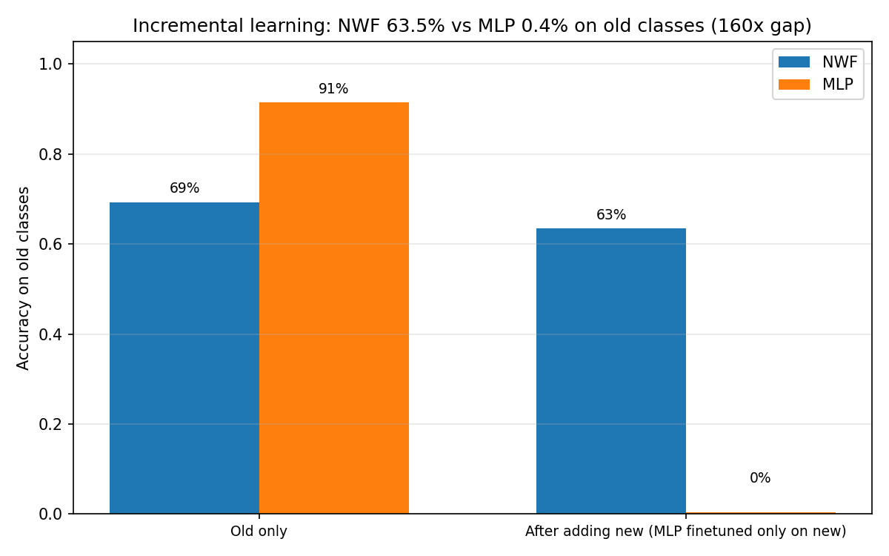
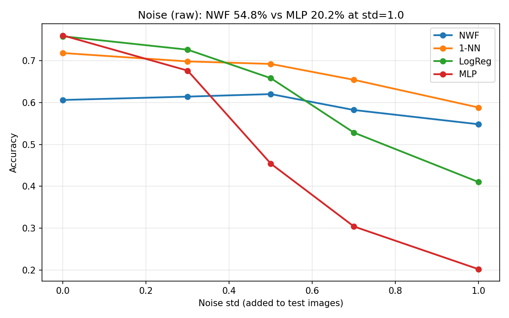
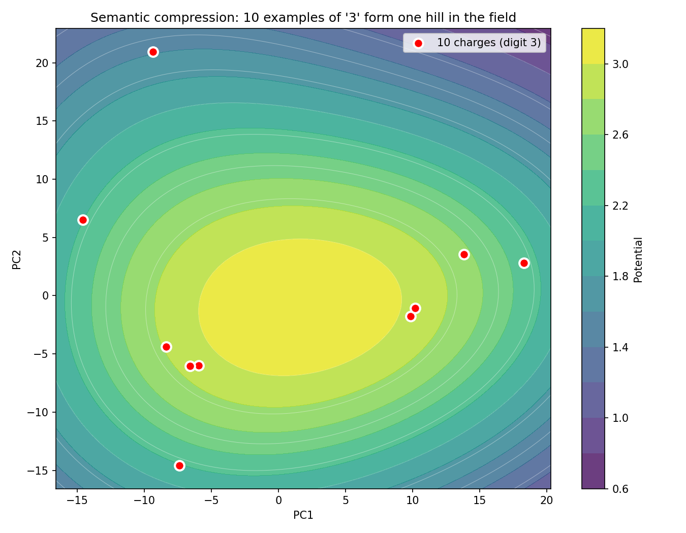

# Нейровесовые Поля: 160x — почему нейросеть забывает, а модель на зарядах нет

---

## Введение

Обучили модель различать кошек и собак. Добавили класс «птицы» — и она начала путать кошек с собаками. Знакомый сценарий? Это **катастрофическое забывание**: при дообучении на новых данных нейросеть перезаписывает веса и теряет прежние навыки. А если бы модель не забывала?

Мы проверили альтернативный подход — **Нейровесовые Поля (NWF)** [(препринт)](https://doi.org/10.24108/preprints-3113697). Вместо обратного распространения — трассировка луча в градиентном поле гауссовых зарядов. Данные хранятся как «заряды», классификация — взвешенное голосование. Новые знания добавляются без изменения старых.

**Главный результат:** при дообучении MLP только на новых классах (без доступа к старым) модель на зарядах сохраняет **63.5%** точности на прежних классах, тогда как классическая нейросеть падает до **0.4%**. **Разрыв в 160 раз** — не доли процента, а порядки величины.



*Рис. 1. Инкрементальное обучение на сырых пикселях: NWF сохраняет 63.5% на старых классах, MLP падает до 0.4%*

---

## О реализации

**Важное уточнение.** Эксперименты ниже выполнены на **упрощённой реализации**: заряды строятся на эмбеддингах CNN с фиксированной ковариацией sigma. В полной теории [(препринт, раздел 3)](https://doi.org/10.24108/preprints-3113697) каждый заряд получает **собственную ковариацию Σᵢ** через байесовский вывод (VAE, MAP-оценка), а поиск ведётся по **расстоянию Махаланобиса**. Полноценная реализация по теории — в разработке: [nwf-research](https://github.com/romero19912017-ui/nwf-research), [план исследований](PLAN_ISSLEDOVANIY.md). Текущая демонстрация подтверждает ключевую идею: модель на зарядах не забывает при инкрементальном добавлении классов.

---

## Теория NWF (кратко)

Согласно [препринту](https://doi.org/10.24108/preprints-3113697), Нейровесовые Поля строятся так:

- **Заряд** — обучающий пример представляется гауссовым зарядом: позиция z (семантическое ядро), интенсивность q, ковариация Σ. Расстояние — Махаланобиса: ‖r−z‖Σ = √((r−z)ᵀ Σ⁻¹ (r−z)). В полной теории Σᵢ индивидуальна и получается из байесовского вывода.
- **Поле потенциала** — φ(r) = Σ q·exp(−0.5·d²). Суперпозиция вкладов всех зарядов (Аксиома А4).
- **Трассировка** — тестовая точка движется по градиенту потенциала (подъём к максимуму), «притягиваясь» к скоплению зарядов своего класса.
- **Классификация** — взвешенное голосование по потенциалам в конечной точке.

**Ключевое отличие:** нет обратного распространения при добавлении данных; новые классы добавляются как новые заряды без изменения старых.

---

## Экспериментальная установка (упрощённая реализация)

- **Данные:** MNIST (нормализация: среднее 0.1307, стандартное отклонение 0.3081).
- **Энкодер:** предобученная свёрточная сеть на MNIST, выход 64 измерения. *В полной реализации — VAE с байесовским выводом (z, Σ).*
- **NWF:** хранилище зарядов; sigma масштабируется по √dim; трассировка 20 шагов; взвешенное голосование по 10 соседям.
- **Базовые методы:** 1-NN, LogReg, MLP (два слоя 128–64).
- **Seed:** 42.

---

## 1. Главный эксперимент: инкрементальное обучение

Берём сырые пиксели (784) без энкодера. MLP обучается на классах 0–4, затем дообучается **только на 5–9** (50 эпох) — имитация потока новых данных без доступа к старым.

| Метод | Точность на старых (этап 1) | Точность на старых (после дообучения только на новых) |
|-------|-----------------------------|-------------------------------------------------------|
| **NWF** | 69.3% | **63.5%** |
| **MLP** | 91.5% | **0.4%** |

**Разрыв: NWF в ~160 раз точнее MLP** на прежних классах. Модель на зарядах сохраняет работоспособность — новые заряды дополняют старые.

---

## 2. Устойчивость к шуму

**Протокол:** K=10, шум (с.к.о. 0–1.0) на тестовых изображениях.

| С.к.о. шума | NWF | 1-NN | LogReg | MLP |
|-------------|-----|------|--------|-----|
| 0.0 | 60.6 | 71.8 | 75.8 | 76.0 |
| 0.5 | **62.0** | 69.2 | 65.8 | 45.4 |
| 1.0 | **54.8** | 58.8 | 41.0 | **20.2** |

При с.к.о. 1.0: **NWF в 2.7 раза точнее MLP** (54.8% vs 20.2%). В полной теории учёт Σᵢ через Махаланобис даёт ещё бо́льшую устойчивость (по препринту: −5% vs −12% у статических эмбеддингов при σ=0.2).



*Рис. 2. Устойчивость к сильному шуму (с.к.о. 0–1.0): NWF в 2.7 раза точнее MLP*

---

## 3. Семантическое сжатие (демонстрация)

10 начертаний цифры «3» → 10 зарядов. Потенциал в их окрестности образует **один холм** (суперпозиция). Поле компактно представляет кластер. В полной теории проверяется коэффициент сжатия (по препринту: NWF 152x vs FAISS 100x на MNIST).



*Рис. 3. Семантическое сжатие: 10 начертаний «3» → один холм потенциала*

---

## 4. Обучение с малым числом примеров

На сырых пикселях при K=1–3 все методы дают ~38–59%. NWF не демонстрирует преимущества; для выраженного разрыва нужна полная реализация с индивидуальными Σᵢ.

---

## 5. Сравнение с методами непрерывного обучения

EWC, iCaRL и буферы воспроизведения смягчают забывание через регуляризацию или хранение примеров. NWF предлагает **иной принцип**: новые знания добавляются как заряды, без перезаписи. Полноценное сравнение с EWC/iCaRL — в плане исследований.

---

## 6. Возможные применения

**Семантическая память и RAG.** NWF как слой долговременной памяти: факты — заряды, рост без перезаписи. **Непрерывное обучение и AGI.** Компонент памяти в архитектурах без забывания. **Доверенный ИИ.** Ковариация Σ даёт меру уверенности; возможность отказа при сомнениях.

---

## 7. Выводы

1. **Инкрементальность:** NWF сохраняет 63.5% на прежних классах; MLP падает до 0.4%. **Разрыв в 160 раз.**
2. **Сильный шум:** NWF в 2.7 раза точнее MLP при с.к.о.=1.0.
3. **Упрощённая реализация** — proof-of-concept. Полная реализация (VAE, Σᵢ, Махаланобис) и сравнение с FAISS, EWC, iCaRL — в [nwf-research](https://github.com/romero19912017-ui/nwf-research).

---

## 8. Ограничения и дальнейшие шаги

- Текущая реализация использует эмбеддинги и фиксированную sigma; полная теория требует байесовского кодирования (VAE) и индивидуальных Σᵢ.
- Сравнение с EWC/iCaRL и FAISS — в плане.
- **План исследований:** [PLAN_ISSLEDOVANIY.md](PLAN_ISSLEDOVANIY.md) — этапы, гипотезы H1–H3, целевые метрики из препринта.

---

## Воспроизводимость

**Демонстрационный код (упрощённая реализация):** папка `demo_mnist/` в [nwf-research](https://github.com/romero19912017-ui/nwf-research)

```powershell
conda activate nwf_torch
cd nwf-research/demo_mnist

python experiments/run_incremental_aggressive.py --k 10 --use-tfds --cpu --finetune-epochs 50
python experiments/run_noise_aggressive.py --k 10 --noise-levels "0,0.3,0.5,0.7,1.0" --use-tfds --cpu
python experiments/plot_results.py --aggressive
```

---

## Ссылки

- [Препринт NWF](https://doi.org/10.24108/preprints-3113697)
- [nwf-research](https://github.com/romero19912017-ui/nwf-research) — код (демо в demo_mnist/, полная реализация в разработке)
